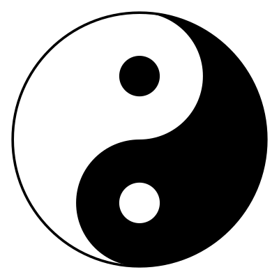

<p align="center">
  <picture>
    <source media="(prefers-color-scheme: dark)" srcset="assets/logo-dark.svg">
    <source media="(prefers-color-scheme: light)" srcset="assets/logo.svg">
    
  </picture>
</p>

<h1 align="center">Taiji</h1>

<p align="center">
  <strong>Two agents. One evolving truth.</strong>
</p>

<p align="center">
  <a href="LICENSE"></a>
  <a href="https://www.python.org/"></a>
  <a href="https://pypi.org/project/claude-agent-sdk/"></a>
</p>

---

Most AI research loops look the same: run the model, check the metric, tweak, repeat. The goal never changes. The evaluation never gets harder. If the model finds a shortcut, nobody notices.

Taiji works differently. Two agents take turns. **Yin** defines a world and writes acceptance criteria. **Yang** searches for a solution that passes. When yang succeeds, yin inspects *how* -- finds the loophole, tightens exactly one constraint, and the cycle restarts. The problem gets harder every round. Shortcuts get caught.

The runtime itself has no opinions. It runs the cycle, records what happened, and stays out of the way.

## How It Works

```
                    ┌─────────────────────────┐
                    │      Seed Phase          │
                    │  Yin defines world()     │
                    │  and passes(results)     │
                    └────────────┬────────────┘
                                 │
                    ┌────────────▼────────────┐
              ┌────►│      Yang Turn           │
              │     │  Search for a solution   │
              │     │  that satisfies the law  │
              │     └────────────┬────────────┘
              │                  │
              │          passed? │
              │       ┌─────────┴─────────┐
              │       │ no                │ yes
              │       ▼                   ▼
              │    retry            ┌───────────┐
              │                     │  Yin Turn  │
              │                     │  Find the  │
              │                     │  loophole. │
              │                     │  Tighten   │
              │                     │  one       │
              │                     │  constraint│
              │                     └─────┬─────┘
              │                           │
              │                  changed? │
              │                ┌──────────┴──────┐
              │                │ yes              │ no
              └────────────────┘           converged ■
```

**Yin** owns the world and the law: `world() -> dict`, `passes(results) -> bool`, optional `score(results) -> dict`.

**Yang** owns the search: `run() -> dict`. A JSON object tested against the frozen law.

**The host** just runs the cycle. No intelligence. No criteria. If it had opinions, the whole thing breaks.

## Quick Start

```bash
pip install -e .

# Create a unit -- this is your research problem
python -m taiji.cycle new my_unit --goal "Build a self-improving model."

# Seed the law (yin writes world() and passes())
python -m taiji.cycle seed --unit-root units/my_unit --new

# Run the loop (needs Claude Agent SDK)
pip install -e ".[agent]"
python -m taiji.loop --unit-root units/my_unit --new --iterations -1
```

The loop runs until yang passes and yin has nothing left to tighten. Or until you stop it.

## Architecture

```
taiji/
  taiji/runtime/
    schema.py         Filesystem helpers, dynamic module loading
    cycle.py          Core yin/yang mechanics (no SDK dependency)
    law.py            Immutable law snapshots, validation, materialization
    prompts.py        Prompt templates, rendering, context assembly
    ideas.py          Idea tracking, frontier materialization
    agents.py         Claude Agent SDK turn execution, edit hooks
    loop.py           Main loop orchestrator, CLI
    watch.py          Supervisor process (restart on crash)
  prompts/yin_yang/   Shared prompt templates
  units/              Experiment definitions (yin.py, yang.py, prompt.md)
  runs/               Generated run artifacts (gitignored)
```

<details>
<summary><strong>Run artifacts</strong></summary>

Each run materializes under `runs/<unit>/<run_id>/`:

| File | Purpose |
|------|---------|
| `yang.py`, `yin.py` | Live working copies (unit seeds stay untouched) |
| `world.json` | Materialized world from `yin.world()` |
| `law.md` | Frozen law snapshot with source and world |
| `results.json` | Latest yang submission |
| `history.ndjson` | Full iteration history |
| `ideas.ndjson` | Idea records with tags and lineage |
| `frontier.json` | Summary: latest idea, recent attempts, tag counts |
| `queue/` | Per-iteration artifacts and control files |

</details>

<details>
<summary><strong>Loop modes and run selection</strong></summary>

**Run selection:**
- `--new` -- fresh run from unit seeds
- `--run-id <id>` -- resume a specific run
- Default -- resume current run, or create new

**Modes:**
- `--mode adaptive` (default) -- yin refines constraints after yang passes
- `--mode fixed` -- yin seeds once, yang works against a frozen law

**Watchdog:**
```bash
python -m taiji.watch --unit-root units/my_unit --new
```

</details>

<details>
<summary><strong>Prompt overrides</strong></summary>

Units use the shared prompt set in `prompts/yin_yang/` by default. Override any template by placing these in your unit directory:

- `yang_prompt.override.md`
- `yin_prompt.override.md`
- `yin_seed_prompt.override.md`
- `yang_system_prompt.override.txt`
- `yin_system_prompt.override.txt`

</details>

## What the runtime enforces

Yang can only edit `yang.py`. Yin can only edit `yin.py`. Edit hooks enforce this -- no exceptions. If yang writes a brilliant solution that also tweaks yin's acceptance criteria, the edit gets rejected.

Yang is selected harshly. A new `yang.py` is kept only when it beats the current best under the frozen law. Otherwise the turn is thrown out and the previous working copy is restored. Most yang turns get discarded.

Yin's changes are validated for determinism -- `world()` must return the same dict on two consecutive imports. If it doesn't, the change is reverted. No randomness in the law.

Everything is recorded to `history.ndjson` and `ideas.ndjson`. No in-memory state. Kill the process, restart it, pick up where you left off.

## Versioning

Pre-1.0. The core interfaces (`world`, `passes`, `run`) are stable. Everything else might change.

## License

[MIT](LICENSE)
